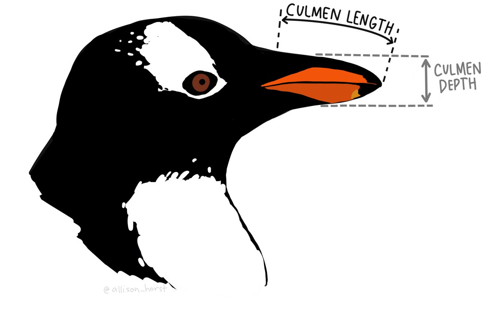
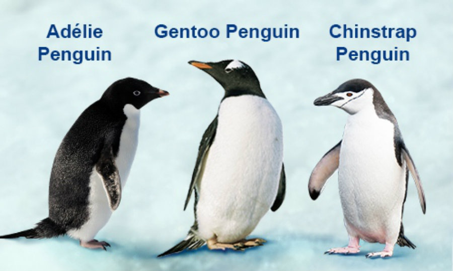
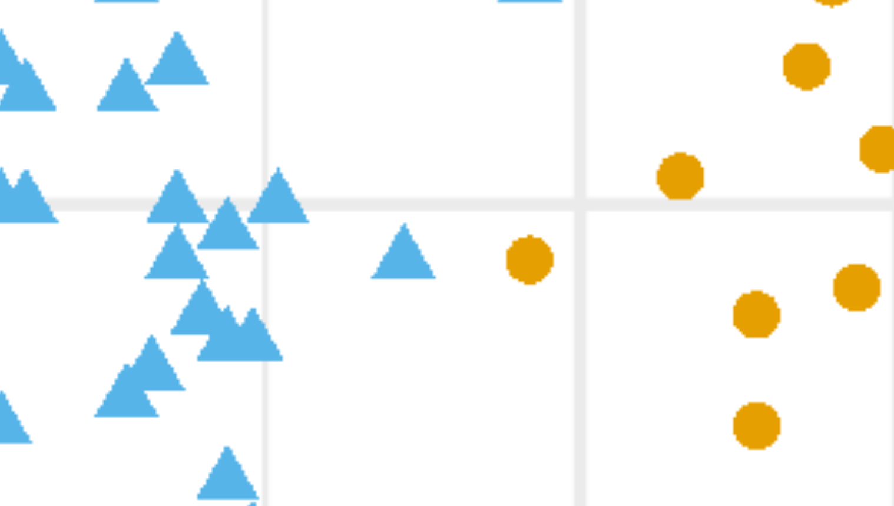
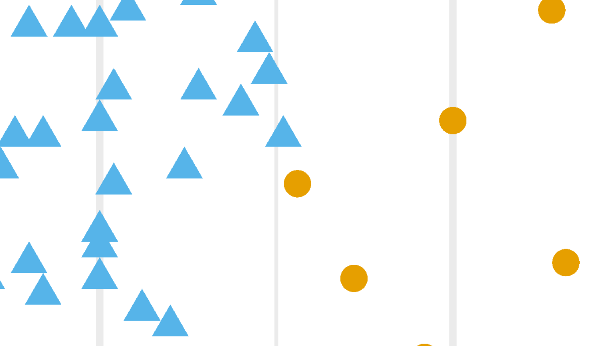

```{r setup, include=FALSE}
knitr::opts_chunk$set(echo = TRUE)
```


## QUESTION 01: Data Visualisation for Science Communication

*Create a figure using the Palmer Penguin dataset that is correct but badly communicates the data. **Do not make a boxplot**.*

### a) My misleading figure:

```{r bad figure code, echo=FALSE, message=FALSE, warning=FALSE}
# Load the packages:
library(ggplot2)
library(palmerpenguins)
library(janitor)
library(dplyr)

data("penguins")

# Finding the average bill length of the penguins by species 
avg_billlength <- penguins %>%
  group_by(species) %>%
  summarise(avg_billlength = mean(bill_length_mm, na.rm = TRUE))

# Reordering the x-axis categories
avg_billlength$species <- factor(avg_billlength$species, 
                                   levels = c("Adelie", "Gentoo", "Chinstrap"))

# Plotting the data (badly)
ggplot(avg_billlength, aes(x = species, y = avg_billlength)) +
  geom_bar(stat = "identity", fill = "skyblue") +
  labs(x = "Species", y = "Average Bill Length") +
  ggtitle("Average Bill Length by Species") +
  scale_y_continuous(breaks = c(35, 40, 45, 50), labels = c(35, 40, 45, 50)) +
  coord_cartesian(ylim = c(35, 50))+
  geom_point(position = position_dodge(width = 0.75), color = "black", size = 3) +
  geom_line(aes(group = 1), position = position_dodge(width = 0.75), color = "red", size = 1) 
```

### b) Write about how your design choices mislead the reader about the underlying data (200-300 words).

There are a few common ways in which graphs are misleading. The first is when the y-axis is cut off so that it does not start from zero. This is known as an omitted baseline, or y-axis truncation (Olande, 2013). The resulting areas of the bar graphs are no longer representative of the actual value they hold; it exaggerates their differences. This is a common issue in both the media and research publications. For example, a chart aired on Fox News depicted a bar graph of the increase of tax rate if the Bush Tax Cuts expired. The bar representing the future if the tax cuts did expire was 6 times taller than the first bar (representing the present), despite the fact that there was just a 4.6% tax rate increase (ratio of 1.13 to 1) (Correll, 2020). This is what has occurred in my design, as the y-axis only starts at 35, making the average bill length of Adelie penguins seem proportionally much smaller than the other penguins than it actually is. Furthermore, by ordering the species by increasing bill length and using a line to show the 'increasing trend', it gives the impression that there is continuity or progression between species. This implies a relationship or trend where none exists. By combining these erroneous manipulations - the omitted baseline and a fake 'increasing trend', the graph misleads viewers into perceiving a significant trend or relationship between the categories when, in fact, there might not be one.

**References** 

Correll, M., Bertini, E., & Franconeri, S. (2020, April). Truncating the y-axis: Threat or menace?. In Proceedings of the 2020 CHI Conference on Human Factors in Computing Systems (pp. 1-12).

Olande, O. (2013). Making sense of a" misleading" graph. Nordisk matematikkdidaktikk, 18(1), 5-30.

------------------------------------------------------------------------

## QUESTION 2: Data Pipeline

### Introduction
In this section, I will be analysing the palmerpenguins dataset, which contains entries for three different species of penguin: Adelie, Gentoo, and Chinstrap penguins, all of which are found in Antarctica. I will be looking to see if there is a relationship between culmen length and depth across penguins. In particular, I will be looking to see if culmen length can be predicted by culmen depth. The culmen is the ridge along the top part of the penguin's bill, as demonstrated below. 

{ width=300px }


### Hypothesis
I predict that culmen length will be predicted by culmen depth, and that there will be a positive relationship between the two variables within species. Within species, bigger individuals will have longer and deeper bills, and so the depth and length of their culmens will increase respectively. However, I believe that this relationship will change as we look across species, as the three species are similar in size yet have different bill morphology (see image below), as they are adapted for different functions. This suggests that there will be more fluctuation in the relationship between culmen length and depth across species.

My hypotheses are for regressions within species (I will conduct a separate regression for each to test these hypotheses against).

H₀: The slope of the regression line is equal to zero (β) = 0; culmen length is not predicted by culmen depth 

H₁: The slope of the regression line is greater than zero (β) ≠ 0; an increase in culmen depth predicts an increase in culmen length 

{ width=300px }

### Methods 

To visualise my data, I plotted a scatter graph between culmen length and depth. However, to do this, I first had to undergo several steps demonstrated below to ensure all of my code ran smoothly and was reproducible. 

**Preserving the raw data**

To preserve the raw data, I firstly created a 'data_raw' folder.

```{r, warning=FALSE}
dir.create("data_raw")
```

I then saved the variable penguins_raw as a csv file that will not be worked on.

```{r}
write.csv(penguins_raw, "data_raw/penguins_raw.csv")
```

I could then clean the penguins_raw dataset, knowing that there is a safe read-only version safe in my data_raw folder.


**Cleaning the data**

```{r, warning=FALSE}
penguins_clean <- penguins_raw %>%
  select(-starts_with("Delta")) %>% # The carbon isotopes are not relevant to our analyses
  select(-Comments) %>% # The comments are not necessary for statistical analyses or graphical depictions of the data
  clean_names()
names(penguins_clean) # View the names to ensure they have been correctly cleaned

# Saving the cleaned data as a separate csv file 
dir.create("data_clean/")
write.csv(penguins_clean, "data_clean/penguins_clean.csv")
```

I created a new variable called 'penguins_clean' so that I did not override the penguins_raw variable, and therefore by creating a new variable with the removed columns, this code can be repeatedly run without causing any errors. This is done through the package dplyr using piping, which is where the operator %\>% allows multiple functions to be joined together in their specific order.

It was then necessary to clean the names of the columns, as they are very problematic in the raw dataset; they include mixed capitals and lower case letters, and spaces between words which often causes issues in coding. Whilst it may be easier to make changes to the column names directly in the excel spreadsheet, this is unreproducible, as others cannot see these changes taking place. Therefore we must change them in our code. This can be done by adding an extra line of code to our data cleaning, using the piping operator %\>% to include name cleaning in the overall cleaning function. The clean_names() function is part of the janitor package and is used to standardise column names within a data frame: it converts capital letters to lower case; replaces spaces, punctuation, and special characters from column names with underscores; and removes characters that are not letters, numbers, or underscores.

Here I created a folder of functions, to put the cleaning function inside

```{r, warning=FALSE}
dir.create("functions/")
```

It is easier to make the cleaning code into a function, so that it can easily be applied to any other code. This makes the code reusable. I have called this function 'cleaning'

```{r}
cleaning <- function(data_raw){ # 'data' must be general so it can be applied to other code 
  data_raw %>% 
    clean_names() %>% # function from janitor package
    select(-starts_with("delta")) %>% # removing the same columns that were not useful in our previous cleaning function 
    select(-comments) %>% 
    remove_empty(c("rows", "cols")) # removes any empty columns or rows
}

penguins_clean2 <- cleaning(penguins_raw)
names(penguins_clean2)
```


**Creating a scatterplot**

To visualise the relationship between culmen length and depth, I created a scatterplot, as both variables are continuous. I differentiated between each species' data on the graph using a different colour and shape. Without this differentiation, there does not appear to be any significant trend between the two variables. However, once we can see the different species' data points, it becomes clear that some relationship does exist.

```{r, warning=FALSE}
base <- ggplot(penguins_clean, aes(x = culmen_depth_mm, y = culmen_length_mm, group = species)) +
  geom_point(aes(color = species, shape = species)) +
  scale_shape_manual(values=c(3, 16, 17))+
  scale_color_manual(values=c('#222222','#E69F00', '#56B4E9'))+
  labs(x = "Culmen Depth (mm)", y = "Culmen Length (mm)", colour = "Species") +
  theme_bw()
penguin_bar <- base + labs(shape = "Species", colour = "Species") +
  ggtitle("Relationship between Culmen Depth and Length across 3 Penguin Species")
penguin_bar
```


**Rescaling and saving the figure**

I then tested different versions of the figures: modifying the height, width, and dpi (a proxy for resolution). Here I have inserted two images of the same part of the graph zoomed in, but with different dpis to show the difference resolution makes. The first image is with a dpi of 300, and the second is with a dpi of 1000. 

{ width=300px }

{ width=300px }


Clearly, a higher resolution makes a big difference to making these images look sharper!


I saved all of these different graphs into my 'figures' folder.

```{r, warning=FALSE}
library(ggplot2)
# Experimenting with different versions of the figure
# These I have saved to the general working directory 
ggsave("/home/alanazammit/Reproducible_Figures_git/figures/penguin_bar.png", plot = penguin_bar,width = 6, height = 4, dpi = 300)
ggsave("/home/alanazammit/Reproducible_Figures_git/figures/morewidth.png", plot = penguin_bar,width = 10, height = 4, dpi = 300)
ggsave("/home/alanazammit/Reproducible_Figures_git/figures/moreheight.png", plot = penguin_bar,width = 6, height = 10, dpi = 300)
ggsave("/home/alanazammit/Reproducible_Figures_git/figures/moreres.png", plot = penguin_bar,width = 6, height = 4, dpi = 1000)

# Scaling it - this will be my final plot, and so I will save it in my figures folder, and rename it
# something more clear that it is my final figure
scaling_factor <- 1.2
ggsave("/home/alanazammit/Reproducible_Figures_git/figures/final_figure.png", plot = penguin_bar, width = 6*scaling_factor, height = 4*scaling_factor, dpi = 1000)
```


### Statistical Method

I decided to perform a linear regression: one for the whole dataset, and one for each of the species, between culmen length and depth, to see if culmen length can be predicted by culmen depth.  

**Testing the assumptions of linear regression**

Firstly, I had to test that the assumptions of linear regression are true for my dataset: normality and linearity. The residual graphs on the left test the assumption of linearity, and the Q-Q plots test for normality. 

- Row 1: Model for all species together
- Row 2: Model for Adelie penguins only
- Row 3: Model for Chinstrap penguins only
- Row 4: Model for Gentoo penguins only


```{r, figures-side, fig.show="hold", out.width="50%", echo = FALSE, message=FALSE}

library(gridExtra)
# residual model for all 
model <- lm(culmen_length_mm ~ culmen_depth_mm, data = penguins_clean)
res <- resid(model)
plot(fitted(model), res)
abline(0,0)

# Q-Q plot for all 
qqnorm(res)
qqline(res)

# residual model for each species 
adelie_data <- subset(penguins_clean, species == "Adelie Penguin (Pygoscelis adeliae)")
  adelie_model <- lm(data = adelie_data, culmen_length_mm ~ culmen_depth_mm)
res_adeline <- resid(adelie_model)
plot(fitted(adelie_model), res_adeline)
abline(0,0)
qqnorm(res_adeline)
qqline(res_adeline)

chinstrap_data <- subset(penguins_clean, species == "Chinstrap penguin (Pygoscelis antarctica)")
  chinstrap_model <- lm(culmen_length_mm ~ culmen_depth_mm, data = chinstrap_data)
  res_chinstrap <- resid(chinstrap_model)
plot(fitted(chinstrap_model), res_chinstrap)
abline(0,0)
qqnorm(res_chinstrap)
qqline(res_chinstrap)

gentoo_data <- subset(penguins_clean, species == "Gentoo penguin (Pygoscelis papua)")
  gentoo_model <- lm(culmen_length_mm ~ culmen_depth_mm, data = gentoo_data)
res_gentoo <- resid(gentoo_model)
plot(fitted(gentoo_model), res_gentoo)
abline(0,0)
qqnorm(res_gentoo)
qqline(res_gentoo)
```

Overall, it appears that the data fits the assumptions of normality and linearity, and so it is appropriate to fit it with a linear model. 


I then conducted a linear regression for all of the species together, and for each of the species individually

**Linear regression without differentiating by species:**

```{r, message=FALSE, warning=FALSE, results='hide'}
model <- lm(culmen_length_mm ~ culmen_depth_mm, data = penguins_clean)
summary(model)
```


**Linear regression with differentiation by species:**

I then conducted three different linear regressions for each species separately, to see if culmen length can be predicted by culmen depth within any of these species.

I did this for adelie penguins first:

```{r, results='hide'}
library(dplyr)
adelie_data <- subset(penguins_clean, species == "Adelie Penguin (Pygoscelis adeliae)")
  adelie_model <- lm(data = adelie_data, culmen_length_mm ~ culmen_depth_mm)
  summary(adelie_model)
```

For chinstrap penguins:

```{r, results='hide'}
chinstrap_data <- subset(penguins_clean, species == "Chinstrap penguin (Pygoscelis antarctica)")
  chinstrap_model <- lm(culmen_length_mm ~ culmen_depth_mm, data = chinstrap_data)
  summary(chinstrap_model)
```

And finally for gentoo penguins:

```{r, results='hide'}
gentoo_data <- subset(penguins_clean, species == "Gentoo penguin (Pygoscelis papua)")
  gentoo_model <- lm(culmen_length_mm ~ culmen_depth_mm, data = gentoo_data)
  summary(gentoo_model)
```


## Results 

**Linear regression without differentiating by species:**
```{r, message=FALSE, warning=FALSE, echo=FALSE}
model <- lm(culmen_length_mm ~ culmen_depth_mm, data = penguins_clean)
summary(model)
```
These results suggest that the relationship between culmen length and depth is negative, with a 1mm increase in culmen depth leading to a 0.6498mm decrease in culmen length. This relationship was found to be statistically significant, with a p-value of 1.12e-05.

If we display this regression on the graph:

```{r, warning=FALSE, message=FALSE}
lm_combined_graph <- ggplot(penguins_clean, aes(x = culmen_depth_mm, y = culmen_length_mm)) +
  geom_point() +
  geom_smooth(method = "lm", se = FALSE) +
  labs(title = "Linear Regression between Culmen Length and Depth",
       x = "Culmen Depth (mm)",
       y = "Culmen Length (mm)") +
  theme_bw()
lm_combined_graph
```

We can see the negative gradient of the regression line, suggesting culmen depth negatively predicts culmen length.


**Linear regression with differentiation by species**

However, if we do differentiate by species, and perform a linear regression for each species separately, we find very different results.


Adelie penguins:

```{r, echo=FALSE}
library(dplyr)
adelie_data <- subset(penguins_clean, species == "Adelie Penguin (Pygoscelis adeliae)")
  adelie_model <- lm(data = adelie_data, culmen_length_mm ~ culmen_depth_mm)
  summary(adelie_model)
```
Slope estimate of 0.857: a positive relationship. This suggests that for every one mm change in culmen depth (the predictor variable), there will be a 0.857mm change in culmen length (the response variable). This relationship has a P-value of 6.67e-07, meaning there is strong evidence against the null hypothesis of no relationship. 


For chinstrap penguins:

```{r, echo=FALSE}
chinstrap_data <- subset(penguins_clean, species == "Chinstrap penguin (Pygoscelis antarctica)")
  chinstrap_model <- lm(culmen_length_mm ~ culmen_depth_mm, data = chinstrap_data)
  summary(chinstrap_model)
```
Slope estimate of 1.922: again, a positive relationship, with culmen length increasing by 1.922mm per 1mm increase in culmen depth 


And finally for gentoo penguins:

```{r, echo=FALSE}
gentoo_data <- subset(penguins_clean, species == "Gentoo penguin (Pygoscelis papua)")
  gentoo_model <- lm(culmen_length_mm ~ culmen_depth_mm, data = gentoo_data)
  summary(gentoo_model)
```
Slope estimate of 2.0208: a positive relationship, with culmen length increasing by 2.0208mm per 1mm increase in culmen depth 


In each of these regressions, the slope of the regression line was not equal to zero, and so I can reject the null hypotheses and conclude that culmen length can be predicted by culmen depth. The relationship was found to be positive, although to varying degrees.


**Displaying each species' linear regression graphically**

I then plotted the linear regression of each species onto one graph, to show the three relationships between culmen length and depth. 

```{r, message=FALSE, warning=FALSE}
lm_graph <- ggplot(penguins_clean, aes(x = culmen_depth_mm, y = culmen_length_mm, color = species)) +
  geom_point() +
  geom_smooth(method = "lm", se = TRUE) +
  labs(title = "Linear regression for all Penguin Species",
       x = "Culmen Depth (mm)",
       y = "Culmen Length (mm)") +
  scale_color_manual(values = c('#222222', '#E69F00', '#56B4E9')) +
  theme_bw()
lm_graph
```


**Saving the graphs depicting the linear regressions**

Finally, I saved the two graphs showing the linear regressions to my 'figures' folder

```{r, warning=FALSE, message=FALSE}
# Saving the linear regression graphs
sf <- 1.2
ggsave("/home/alanazammit/Reproducible_Figures_R/figures/lm_graph.png", plot = lm_graph, width = 6*sf, height = 4*sf, dpi = 1000)
ggsave("/home/alanazammit/Reproducible_Figures_R/figures/lm_combined_graph.png", plot = lm_combined_graph, width = 6*sf, height = 4*sf, dpi = 1000)
```


### Discussion
There is a positive relationship between culmen length and depth within each of the three species tested. All three linear regressions produced statistically significant p-values, which allows us conclude that we can reject the null hypothesis that there is no relationship between these two variables. However, the R-squared value in the Adelie penguin model was low, where only around 15.33% of the variability in culmen length could be explained by culmen depth. In the other two models, this value was greater at around 40%, but still not particularly high. A low R-squared suggests that the variation in culmen length is not explained by culmen depth, and so our models have little predictive power. Other crucial variables have not been investigated, such as body size, ecology (such as the feeding niche), and age of individual, which could have more power in determining the relationship between culmen length and depth. 
  
  The negative relationship between culmen length and depth across species was surprising, but is a result of what is known as 'Simpson’s Paradox'. This is the name given to a trend which is apparent in separate groups of data, but when they are combined to form one dataset, the trend disappears or is reversed. We therefore must exercise caution when combining data from different species, or from any different groupings, as it gives very misleading results. 


### Conclusion
To conclude, the null hypothesis that the slope of the regression line is equal to zero can be rejected to a highly significant degree: culmen length can be predicted by its depth for each of the three species. Within species, an increase in culmen depth predicts in an increase in culmen length. If we combine data across the three species, the positive relationship found within species is reversed, and culmen length can be predicted by its depth in the reverse manner: an increase in depth results in a decrease in length. This is an example of Simpson's paradox, and exemplifies that caution must be taken when combining data from differnet species or groupings into one dataset. Future research should look into whether there is an overarching relationship between culmen length and depth across all penguins species. 

The main limitation of my analysis was that there were many confounding factors not controlled for, that could have easily influenced my results. I analysed data across both sexes, and all ages; both of these variables could have been subgrouped to ensure that the analyses was more accurate. Furthermore, my analyses spanned 3 different islands (Torgerson, Biscoe, and Dream), which may all vary greatly in selective pressures. Therefore, whilst I have concluded that culmen depth can predict culmen length to some extent, the affects of sex, age, and island must all be investigated to determine the strength of this association. 

------------------------------------------------------------------------

## QUESTION 3: Open Science

### a) GitHub

*Upload your RProject you created for **Question 2** and any files and subfolders used to GitHub. Do not include any identifiers such as your name. Make sure your GitHub repo is public.*

*GitHub link:* [Link to my repository on Github](https://github.com/mimzy64/Reproducible_Figures_R)

*You will be marked on your repo organisation and readability.*

### b) Share your repo with a partner, download, and try to run their data pipeline.

*Partner's GitHub link:*

*You **must** provide this so I can verify there is no plagiarism between you and your partner.*

### c) Reflect on your experience running their code. (300-500 words)

-   *What elements of your partner's code helped you to understand their data pipeline?*

-   *Did it run? Did you need to fix anything?*

-   *What suggestions would you make for improving their code to make it more understandable or reproducible, and why?*

-   *If you needed to alter your partner's figure using their code, do you think that would be easy or difficult, and why?*

### d) Reflect on your own code based on your experience with your partner's code and their review of yours. (300-500 words)

-   *What improvements did they suggest, and do you agree?*

-   *What did you learn about writing code for other people?*
